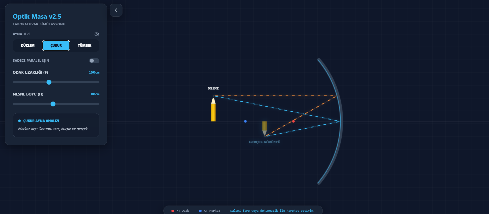

# 🔬 Gerçekçi Optik Masa Simülasyonu (v2.5)

Modern ve etkileşimli bir **Optik Laboratuvar Simülasyonu**.
Düzlem, çukur ve tümsek aynalarda görüntü oluşumunu gerçek zamanlı olarak gözlemleyebileceğiniz gelişmiş bir fizik uygulaması.

Tamamen **HTML + Canvas + TailwindCSS** ile geliştirilmiştir.
## 🖥️ Ekran Görüntüsü



## 🚀 Özellikler

* 🔍 **3 Ayna Türü**

  * Düzlem Ayna
  * Çukur Ayna
  * Tümsek Ayna

* 📐 **Gerçek Zamanlı Optik Hesaplama**

  * Ayna denklemi:
    [
    \frac{1}{f} = \frac{1}{d_o} + \frac{1}{d_i}
    ]

* 📏 **Dinamik Mesafe Ölçümü**

  * Nesne uzaklığı (dc)
  * Görüntü uzaklığı (dg)

* 🎚️ **Kontrol Paneli**

  * Odak uzaklığı ayarı (f)
  * Nesne boyu ayarı (h)
  * Paralel ışın modu
  * Uzaklık göster/gizle
  * Panel aç/kapat

* ✨ **Animasyonlu Işınlar**

  * Gerçek zamanlı ışın takibi
  * Sanal uzantılar kesikli çizgiyle gösterilir
  * Gerçek ve sanal görüntü ayrımı

* 📱 **Mobil Uyumlu**

  * Dokunmatik destekli
  * Responsive tasarım

---


## 🧠 Desteklenen Fizik Senaryoları

### 🪞 Düzlem Ayna

* Görüntü her zaman:

  * Sanal
  * Düz
  * Nesne ile aynı boyda

---

### 🔍 Çukur Ayna

| Nesne Konumu      | Görüntü             |
| ----------------- | ------------------- |
| Merkez dışı       | Ters, küçük, gerçek |
| Merkezde          | Ters, eşit, gerçek  |
| Odak-merkez arası | Ters, büyük, gerçek |
| Odak içinde       | Düz, büyük, sanal   |

---

### 🔵 Tümsek Ayna

* Görüntü her zaman:

  * Sanal
  * Düz
  * Küçük

---

## 🛠️ Kullanılan Teknolojiler

* HTML5 Canvas
* Vanilla JavaScript
* TailwindCSS (CDN)
* Responsive UI
* Gerçek zamanlı animasyon (requestAnimationFrame)

---

## 📂 Kurulum

Projeyi çalıştırmak için:

```bash
git clone https://github.com/fatihtuzcu28/Mirror.git
cd optik-masa
```

Ardından `index.html` dosyasını tarayıcıda açmanız yeterlidir.

Ekstra kurulum gerekmez.

---

## 🎮 Kullanım

* Kalemi fare veya dokunmatik ile sürükleyin.
* Ayna tipini değiştirin.
* Odak uzaklığını ayarlayın.
* Görüntü değişimini gerçek zamanlı izleyin.

---

## 🎯 Eğitim Amaçlı Kullanım

Bu simülasyon özellikle:

* Lise Fizik (Aynalar konusu)
* TYT / AYT Optik
* Üniversite Temel Fizik
* STEM eğitimleri

için uygundur.

---

## 🔮 Gelecek Planları

* 🔬 Mercek (ince kenarlı / kalın kenarlı) ekleme
* 📊 Işın yoğunluğu grafiği
* 🎓 Eğitim modu (adım adım anlatım)
* 🌙 Dark / Light tema seçimi
* 🧮 Otomatik hesaplama paneli

---

## 👨‍💻 Geliştirici

İletişim ve katkı için Pull Request gönderebilirsiniz.

---

## 📜 Lisans

MIT License

---

